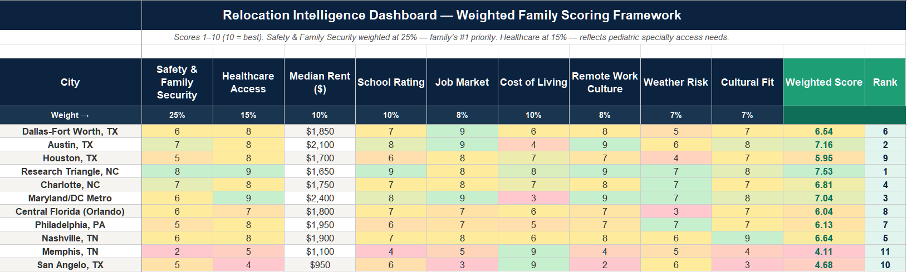
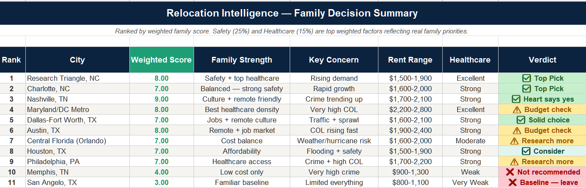

# Relocation Intelligence Framework

**A weighted, data-driven scoring model for evaluating relocation markets based on real family priorities.**

## Overview

Built to solve a real problem — "just Google it" isn't a relocation strategy when you have a medically complex family, homeschooled children, and specific healthcare access requirements.

This framework evaluates 11 target markets across 9 weighted categories, producing a dynamic ranked score that updates automatically when priorities shift.

## How It Works

Each city is scored 1–10 across 9 categories. Categories are weighted by personal priority. The model auto-calculates a weighted overall score and ranks all cities dynamically.

Cost categories (Rent, Cost of Living) use **inverse scoring** — lower cost produces a higher score.

## Categories & Weights

| Category | Weight | Notes |
|---|---|---|
| Safety & Family Security | 25% | #1 priority — includes crime index and neighborhood safety |
| Healthcare Access | 15% | Pediatric specialty access weighted heavily |
| Cost of Living | 10% | Inverse scored |
| Median Rent | 10% | Inverse scored — actual dollar values |
| School Rating | 10% | Homeschool co-op community and legal environment |
| Job Market | 8% | Remote-first — local market as backup |
| Remote Work Culture | 8% | Infrastructure and community |
| Weather Risk | 7% | Severe weather disruption risk |
| Cultural Fit | 7% | Long-term livability |

## Technical Features

- Weighted scoring formulas with dynamic RANK auto-sort
- Inverse scoring logic for cost categories
- VLOOKUP cross-sheet data pulls to executive summary
- Conditional formatting — red/yellow/green auto-applies
- Priority Weights tab — adjust any weight and model recalculates instantly

## Markets Evaluated

Dallas-Fort Worth · Austin · Houston · Research Triangle NC · Charlotte · Maryland/DC Metro · Central Florida · Philadelphia · Nashville · Memphis · San Angelo TX

## Files

| File | Description |
|---|---|
| `Relocation_Intelligence_Dashboard_Sample.xlsx` | Full scoring model with 3 tabs |
| `city-scoring-data.png` | Sheet 1 — scoring grid preview |
| `dashboard-summary.png` | Sheet 2 — executive summary preview |

## Built With

Microsoft Excel · Weighted scoring methodology · Conditional formatting automation · VLOOKUP · RANK formulas

---

*Part of the [ChaosOS™](https://github.com/jennbarron/chaos-os-analytics-framework) personal operations framework.*
